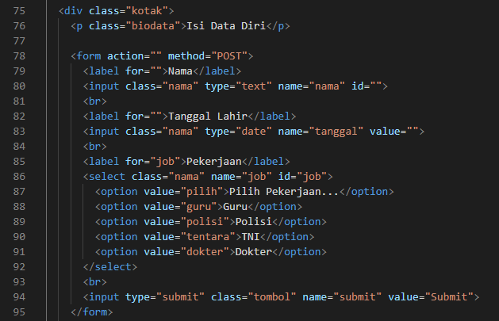
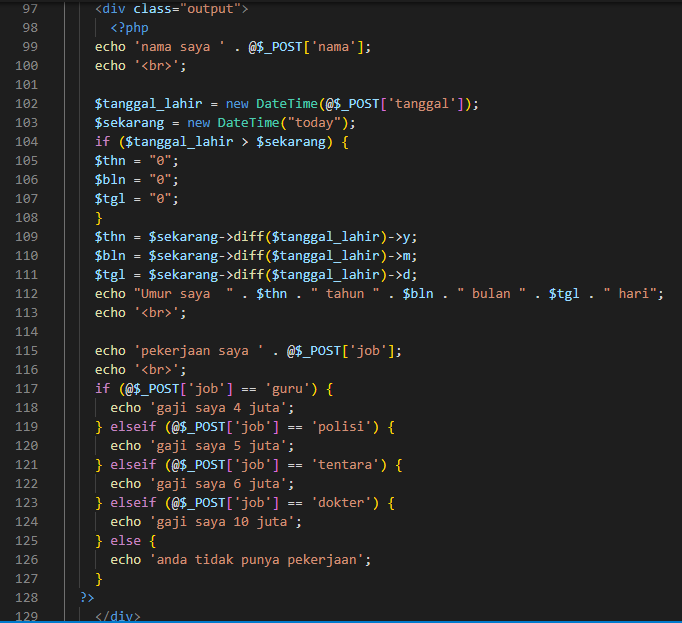
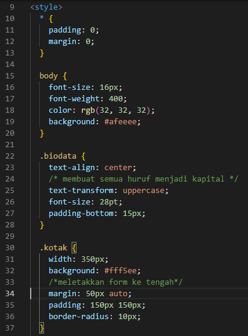
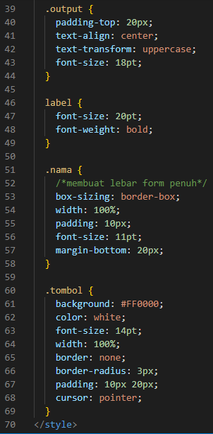
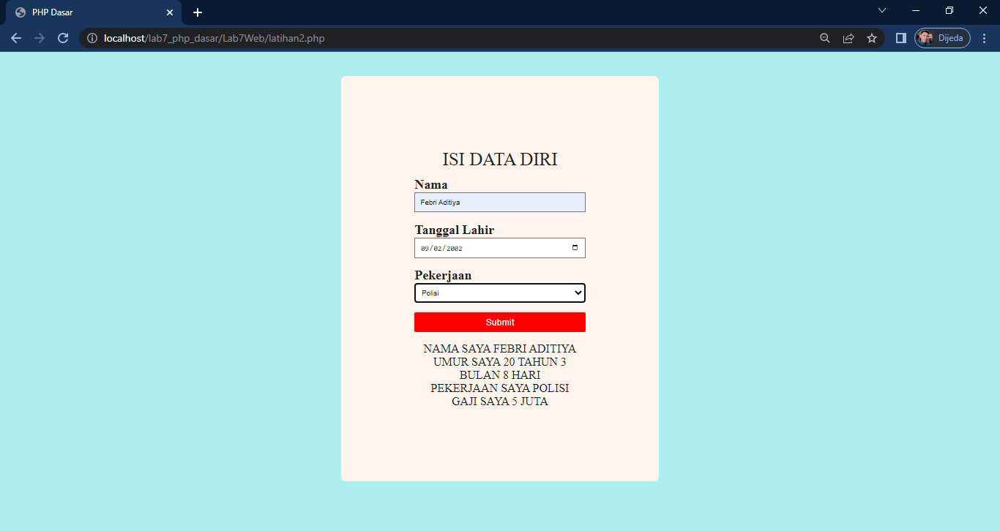

# Lab7Web
### Belajar PHP Dasar

## Tugas dan Pertanyaan
*buatlah Program PHP sederhana dengan menggunakan form input yang menampilkan nama, tanggal lahir dan pekerjaan. Kemudian tampilkan outputnya dengan menghitung umur berdasarkan inputan tanggal lahir. dan pilihan pekerjaan dengan gaji yang berbeda-beda sesuai pilihan pekerjaan.*

Langkah-langkahnya yaitu.
1. Bikin tag HTML terlebih dahulu

2. Buat div dalam body lalu buat form di dalam div tersebut seperti berikut.

### Ini untuk form input.

### Lalu buat div lagi, di dalamnya div berisi variable PHP untuk Outputnya.

*Untuk menambahkan tampilan form ny agar lebih menarik maka berikan style CSS nya*

*Inilah hasil bentuk form nya.*

